<h1 align="center">Hi, I'm Victor</h1>
<h3 align="center">Backend Developer from Argentina 🇦🇷, focused on Java &amp; Spring Boot</h3>

I build and maintain backend services and REST APIs, working across relational and non-relational databases depending on what the problem calls for.

🇦🇷 Leer en español

Desarrollador backend de Argentina, enfocado en Java y Spring Boot. Construyo y mantengo servicios backend y APIs REST, trabajando con bases de datos relacionales y no relacionales según lo que necesite cada proyecto.

  
  
  

 

## 📊 Stats

<!-- Generated by .github/workflows/update-cards.yml, refreshed daily -->

 

## 🛠️ Tech Stack

**Languages & Frameworks**

    
    
    
    

**Databases**

    
    
    

**Work Tools**

    
    
    
    

 

## 📫 Contact

    
    

